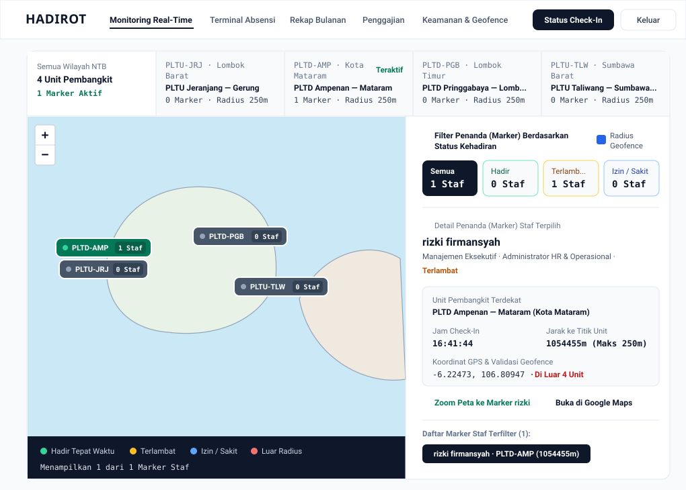

# HADIROT — Sistem Absensi Geospasial Multi-Unit & Penggajian Real-Time

**HADIROT** adalah platform manajemen kehadiran karyawan berbasis geolokasi *real-time* dan penggajian otomatis yang dirancang khusus untuk operasional **Indonesia Power Service (Wilayah Lombok & Sumbawa, NTB)**. Sistem ini memvalidasi kehadiran teknisi dan staf lapangan yang bertugas lintas 4 unit pembangkit listrik secara akurat, mencegah manipulasi lokasi absensi (*anti-titip absen*), menyediakan rekapitulasi bulanan otomatis, pengingat absen pintar, integrasi slip gaji, ekspor laporan PDF/Excel, serta keamanan Autentikasi Dua Faktor (**2FA RFC 6238 TOTP**).

---

## Tampilan Antarmuka Dashboard Monitoring Real-Time (`HADIROT`)


> *Pratinjau Vektor Cadangan (jika `image.png` ditempatkan di direktori `public/docs`):*
>
> 

---

## 4 Unit Kerja Pembangkit Resmi (Geofence Multi-Unit NTB)

Karyawan dan teknisi **Indonesia Power Service** yang berpindah tugas antar unit kerja di wilayah Lombok dan Sumbawa dapat melakukan *check-in* maupun *check-out* secara sah selama berada di dalam radius geofence salah satu dari 4 unit pembangkit berikut:

| Kode Unit | Nama Unit Pembangkit | Wilayah Operasional | Koordinat Pusat (WGS84) | Radius Geofence Default |
| :--- | :--- | :--- | :--- | :--- |
| **PLTU-JRJ** | **PLTU Jeranjang — Gerung** | Kabupaten Lombok Barat | `-8.65940, 116.07480` | `250m – 300m` |
| **PLTD-AMP** | **PLTD Ampenan — Mataram** | Kota Mataram | `-8.57240, 116.07520` | `250m` |
| **PLTD-PGB** | **PLTD Pringgabaya — Lombok Timur** | Kabupaten Lombok Timur | `-8.52450, 116.63420` | `250m` |
| **PLTU-TLW** | **PLTU Taliwang — Sumbawa Barat** | Kabupaten Sumbawa Barat | `-8.73080, 116.79750` | `250m – 300m` |

---

## Fitur Utama

### 1. Peta Interaktif React Leaflet & Kontrol Marker Real-Time (`.leaflet-container`)
- **Pemantauan 4 Unit Pembangkit Sekaligus**: Menampilkan seluruh 4 unit pembangkit (PLTU/PLTD) beserta lingkaran *radius geofence* dan penanda unit mana yang paling aktif saat ini (**Teraktif**).
- **Efek Hover & Tooltip Instan Tanpa Klik**: Mengarahkan kursor ke penanda (*marker*) otomatis memperbesar ikon secara halus (`scale(1.18)`) dan menampilkan *tooltip* nama lokasi beserta jumlah aktivitas staf saat ini tanpa perlu mengklik.
- **Animasi Transisi `flyTo` saat Klik Marker**: Mengklik marker unit pembangkit atau marker staf otomatis menjalankan animasi kamera `flyTo` yang memusatkan peta tepat ke koordinat marker tersebut dan membuka *popup* ringkasan unit serta daftar staf yang bertugas.
- **Sidebar Kontrol Filter Status Kehadiran**: Memungkinkan administrator menyaring marker di atas peta secara instan berdasarkan status (**Semua**, **Hadir**, **Terlambat**, **Izin / Sakit**) serta menginspeksi telemetri koordinat GPS dan jarak staf terpilih.

### 2. Terminal Absensi GPS & Proteksi Anti-Manipulasi Lokasi
- **Perhitungan Jarak Haversine Multi-Unit**: Menghitung jarak perangkat karyawan secara langsung ke ke-4 titik unit pembangkit di Lombok & Sumbawa.
- **Kunci Otomatis di Luar Wilayah 4 Unit**: Apabila staf berada di luar radius ke-4 unit pembangkit resmi, tombol *Check-In Hadir* maupun *Lembur* dikunci secara otomatis sehingga staf tidak dapat memalsukan lokasi kehadiran.

### 3. Notifikasi Pengingat Otomatis (*Automated Attendance Reminders*)
- **Deteksi Staf Belum Check-In**: Dashboard secara otomatis mendeteksi staf yang belum melakukan *check-in* pada tanggal berjalan.
- **Pengiriman Pengingat Sekali Klik**: Administrator dapat mengirimkan notifikasi pengingat otomatis langsung ke terminal staf yang bersangkutan, lengkap dengan status konfirmasi (*Tandai Sudah Dibaca*).

### 4. Rekapitulasi Laporan Bulanan Otomatis & Integrasi Penggajian (*Payroll*)
- **Kalkulasi Kinerja Otomatis**: Menghitung akumulasi hari hadir, hari tepat waktu, insiden keterlambatan, total menit keterlambatan, jam kerja, serta **Skor Kedisiplinan (%)** setiap staf secara *real-time*.
- **Sinkronisasi Slip Gaji (*Take Home Pay*)**: Mengonversi rekap kehadiran bulanan menjadi slip gaji lengkap yang mencakup Gaji Pokok, Tunjangan Kehadiran Harian, Upah Lembur, Potongan Keterlambatan Otomatis, serta Potongan BPJS & PPh21.

### 5. Ekspor Data ke PDF & Microsoft Excel
- Mendukung pengunduhan langsung laporan **Log Kehadiran Harian**, **Rekapitulasi Kinerja Bulanan**, serta **Slip & Laporan Penggajian Bulanan** ke format **PDF** (`HADIROT_*.pdf`) dan **Excel** (`HADIROT_*.xlsx`).

### 6. Sistem Autentikasi Dua Faktor (2FA — RFC 6238 TOTP)
- Dilengkapi generator kunci rahasia Base32, matriks visual QR Authenticator, serta gerbang verifikasi token OTP 6 digit berdurasi 30 detik untuk melindungi akses data kepegawaian dan finansial.

---

## Teknologi yang Digunakan

- **Frontend**: React 19, TypeScript, Tailwind CSS v4, Lucide Icons
- **Peta Geospasial**: Leaflet & React Leaflet (`MapContainer`, `TileLayer`, `Marker`, `Popup`, `Tooltip`, `Circle`, `flyTo`)
- **Backend & Database Real-Time**: Firebase Authentication (Google Sign-In + TOTP 2FA Gate) & Cloud Firestore dengan aturan keamanan (`firestore.rules`) yang telah diaudit
- **Mesin Ekspor Dokumen**: `jsPDF`, `jspdf-autotable`, dan `SheetJS (xlsx)`

---

## Cara Menjalankan Proyek Secara Lokal

1. **Instal seluruh dependensi paket**:
   ```bash
   npm install
   ```

2. **Jalankan server pengembangan (Port 3000)**:
   ```bash
   npm run dev
   ```

3. **Pemeriksaan tipe TypeScript & Build produksi**:
   ```bash
   npm run lint
   npm run build
   ```
